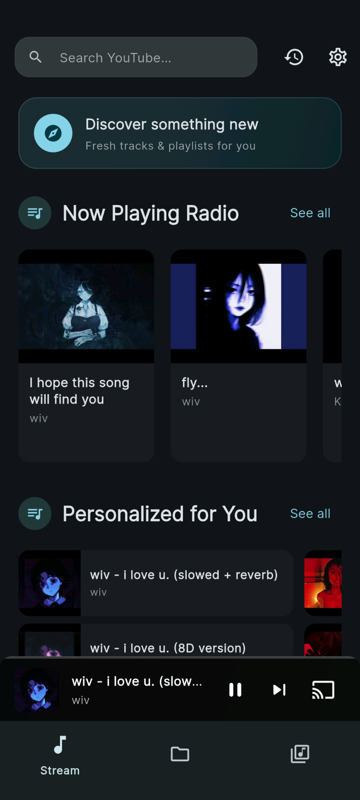
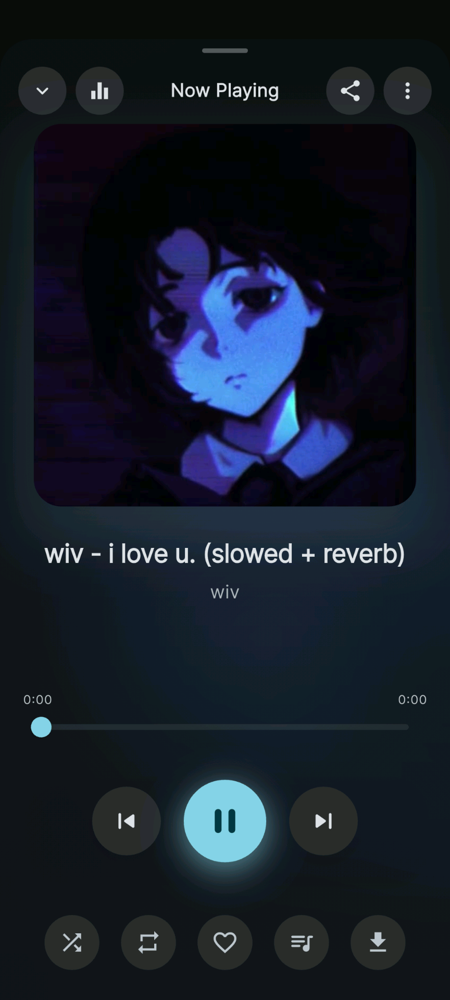
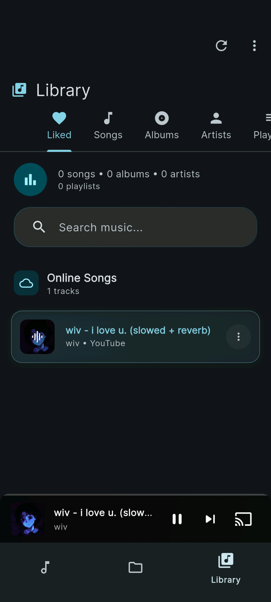
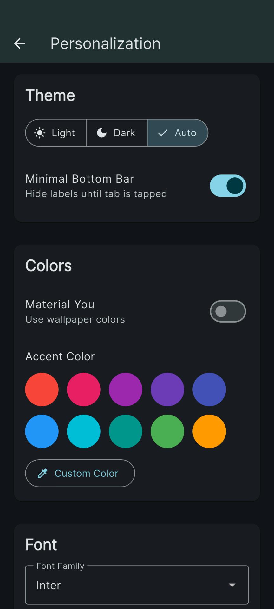
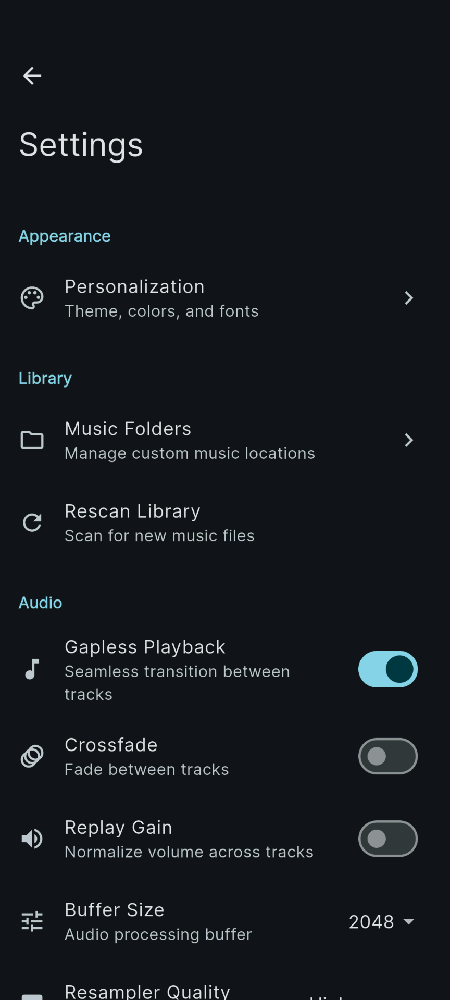
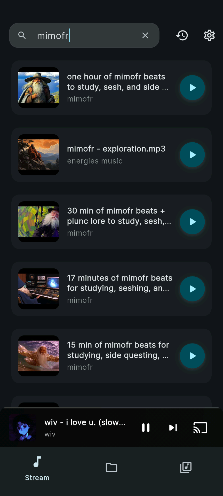
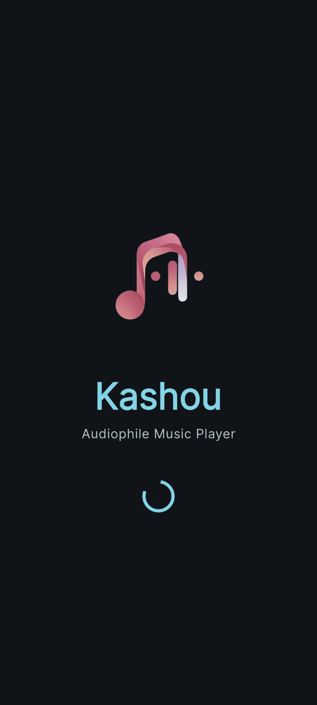

# Kashou

Kashou is an open source music player built with Flutter. I wanted a Poweramp-style local player that could also stream from YouTube, so I built one.

## Features

- Local library playback with queues
- YouTube streaming
- Gapless playback and crossfade
- Equalizer, bass boost and other sound effects
- Background playback and media controls
- Chromecast support

## Gallery

<p align="center">
	
	
	
	
	
	
	
</p>

## Build

```bash
flutter pub get
flutter run
```

## License

See the license file for details.
